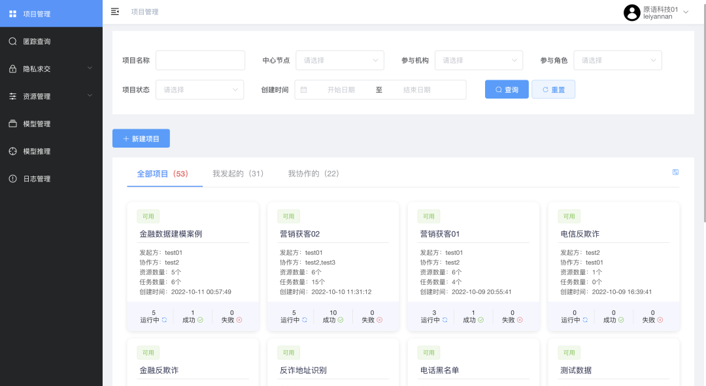
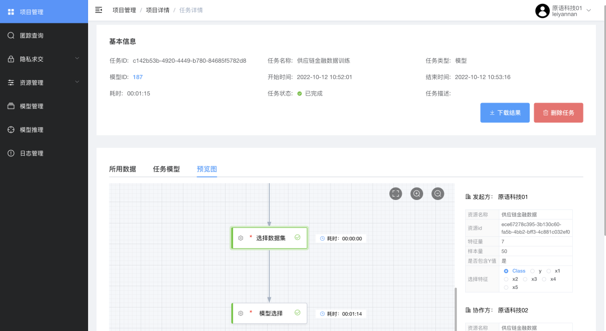
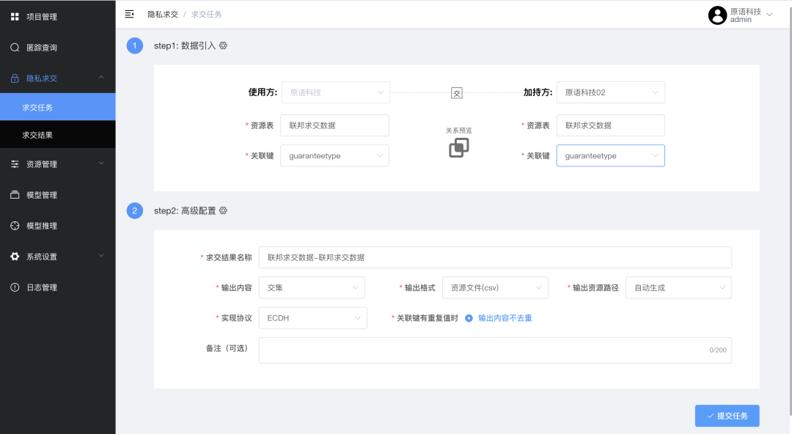

开源隐私计算平台 PrimiHub [v1.3.9](https://github.com/primihub/primihub/releases/tag/1.3.9) 如期而至

<!--truncate-->

[PrimiHub][primihub] 是原语科技自主研发的企业级开源隐私计算平台，其中涵盖了匿踪查询、隐私求交、联合建模、联合统计、算法容器管理、模型推理、数据资源管理、数据确权与定价、异构平台互联互通等主要应用服务功能。用户可通过两种方式使用 [PrimiHub][primihub]：一是通过管理平台更加可视化、更轻松地配置并执行 MPC、PSI、PIR，联邦建模（XGB、LR）、模型推理等任务；二是将服务配置安装至本地，在本地进行 MPC 任务。

## Feature

* 新增横向-LR 模型训练
* 新增匿踪查询历史记录
* 新增平台登陆时的图形校验
* 允许超级管理员查看所有模型数据
* 协作方的私有资源不可见

## Improvement

* 优化任务、模型的删除逻辑
* 优化模型训练图形化设置中的保存流程
* 优化 XGB 并行任务

[primihub]: https://github.com/primihub/primihub
