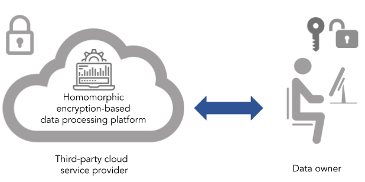
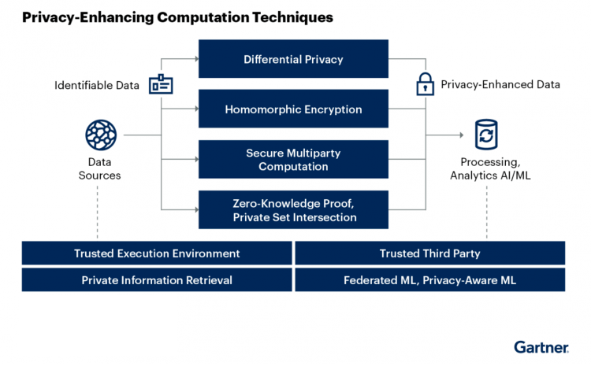

开源同态加密库 [HEhub][hehub] 发布｜首个由国内隐私计算团队研发的(全)同态加密算法库

时至今日，数据要素已经成为数字经济时代最重要的生产要素之一，成为众多企业和机构的核心资产，而数据价值的体现依赖于数据的安全流通和利用。隐私计算作为新兴技术为数据的安全流动提供了新的可能性，即使在数据融合、计算的过程中，也可以保证数据的隐私。在国内外隐私相关法律纷纷颁布、隐私计算产业不断发展的背景下，隐私计算技术的意义和价值已经日渐深入人心。

<!--truncate-->

到目前为止，隐私计算一般分为联邦学习、密码学技术、可信硬件等技术路线。各种技术不是相互排斥的竞争关系，而是在探索中促进相互协同、共同完成保护隐私数据安全流通的目标。在这其中，密码学技术是隐私计算领域一个重要的方向，一些高级的密码学技术如安全多方计算 (secure multi-party computation, MPC)、同态加密 (homomorphic encryption, HE)、零知识证明 (zero-knowledge proof, ZKP) 等分别具有独特的、可证明安全的隐私保护特性，其纷纷在隐私计算领域发挥出各自的作用和优势。

同态加密是最早开始受到关注的隐私计算技术。同态加密的概念由密码学先驱 Ron Rivest 等人在 1978 年提出，指的是一类高级的加密方案，能够在对明文数据进行加密之后，可以不经过解密、在不泄露明文数据任何信息的情况下在密文上进行计算得到新的密文，使得新密文带有明文数据的相应计算结果。这样的特性令同态加密天然地适用于数据隐私受保护的各种外包计算场景，使该领域持续受到密码学界的重视。

图：使用同态加密的外包计算模型（图源：Private AI）

在同态加密技术领域当中，全同态加密 (fully homomorphic encryption, FHE) 是最为深刻且最具广泛应用前景的一类。全同态加密允许计算方在密文上执行任意类型的运算，且计算逻辑可以具有任意深度。自 Rivest 等人提出全同态加密的设想以来，全同态加密技术能否实现一直是密码学界积极探索的问题，以至于被视作密码学领域里的圣杯，并最终直到 2009 年才由 Craig Gentry 构造出第一个理论证明完全可行的全同态加密方案。自从 Gentry 做出突破以来，短短十余年间，全同态加密领域经历了飞速的发展，并已取得极大的进展。目前学术界已经提出了四代全同态加密技术，包括 BFV，BGV，CKKS，TFHE 等方案。

除了多种多样的方案被提出之外，全同态加密技术的演进还体现在效率的极大提高和应用场景的日渐丰富上。在这其中，全同态加密当中重要的自举 (bootstrapping) 过程的效率在数年间提升了上万倍。此外，各种 SIMD 式的编码技术也将运行过程的均摊效率提高了数个量级。总体而言，全同态加密算法的效率正以远超摩尔定律的速度在提升着。而在隐私计算领域，(全)同态加密与其它各种隐私技术结合，已经产生了丰富的应用场景，在隐匿查询、隐私集合求交、基于联邦学习或安全多方计算的联合建模和预测等场景下发挥着重要乃至关键的作用。越来越多基于同态加密的新型隐私计算技术如安全多方计算框架 SPDZ 、labeled PSI、SealPIR、两方机器学习框架 CrypTFlow2 等等正逐渐被行业耳熟能详。

鉴于(全)同态加密无法忽视的发展速度及其重要影响，可以说(全)同态加密已经成为隐私计算行业与企业不可或缺的一条技术路线。在今年全球最具权威的IT研究和顾问咨询公司 Gartner 发布的 2022 年新兴技术和趋势影响力雷达图中显示，同态加密技术连同生成式人工智能、元宇宙等 5 项技术被选为未来最热门和最具影响力的新兴技术。

图：同态加密作为隐私计算不可或缺的技术路线之一（图源：Gartner）

在软件生态方面，尽管目前国际上已有多个开源的 FHE 算法库，然而这些软件库往往有着使用复杂、用的编程语言较小众、学习成本高等阻碍用户上手的问题。此外，一些 FHE 算法库可扩展性不佳，致使其惰于吸纳最新的技术成果，且不利于接入各种上层应用。

基于这样的背景，原语科技推出同态加密开源算法库 [HEhub][hehub]，作为 [PrimiHub][primihub] 开源生态的一部分。[HEhub][hehub] 是一个易于使用，可扩展性强且性能优秀的密码学算法库，致力于汇集各类同态加密算法及其应用。其目前包含了 BGV、CKKS、TFHE 等全同态加密算法，并将进一步集成更多同态加密方案、常用的计算逻辑以及上层应用接口。对开发者而言，[HEhub][hehub] 有助于其跟踪同态加密领域的最前沿进展，将同态加密技术应用到各类隐私计算场景中。与此同时，[HEhub][hehub] 也是国内第一个自研的开源(全)同态加密算法库，及时填补了国内开源生态中的空白，其将有利于国内同行在同态加密领域的前沿研究与落地实践，并促进隐私技术的自主发展。

原语科技独立自主研发的企业级开源隐私计算平台产品 [PrimiHub][primihub]，已获泰岳梧桐资本、相泰投资数千万天使轮投资，并在金融、运营商、政务、工业物联网、医疗等众多领域均有合作，为企业提供了基于隐私安全的数据融合服务，获得客户高度认可与好评。在产学研方面，先后与多所高校建立战略合作关系，成立了多个产学研有机结合的团队，共同开展隐私计算、数据要素化和区块链等领域深度合作。

原语科技拥有专业的密码学团队，致力于与开源社区、各高校和科研院所开展紧密的交流与合作，促进社区的繁荣和同态加密技术的普及、进步。

> 注：以上部分图片来自网络，如有侵权，请联系我们。

[hehub]: https://github.com/primihub/HEhub
[primihub]: https://github.com/primihub/primihub
