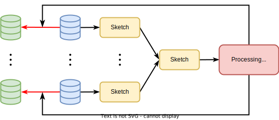

### 简介

FedPS (Federated data Preprocessing with Sketching) 是一个专注于联邦学习下数据预处理的 Python 库。该库的设计旨在突出数据预处理在机器学习建模之前的关键性作用，并通过提供丰富而灵活的功能来实现联邦学习环境中的数据预处理任务。与此同时，FedPS 实现了知名的开源机器学习库 Scikit-learn 中几乎所有的数据预处理模块，为用户提供了一个结合了 Scikit-learn 成熟工具和联邦学习特色的全面解决方案。通过使用 FedPS，用户能够更有效地准备数据，为联邦学习模型的训练奠定坚实的基础。

### 仓库地址

[FedPS](https://github.com/primihub/fedps)
