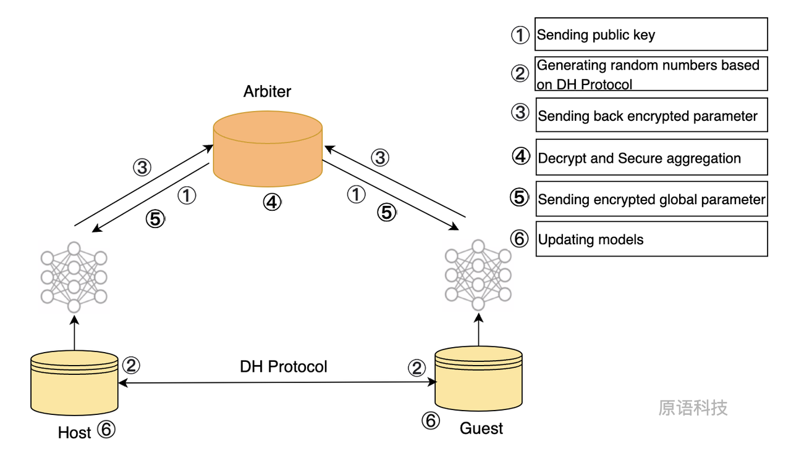

# 横向联邦学习

## 横向联邦学习及其应用场景

### 定义

横向联邦学习也称为按样本划分的联邦学习（Sample-Partitioned Federated Learning或Example-Partitioned Federated Learning），可以应用于联邦学习的各个参与方的数据集有相同的特征空间和不同的样本空间的场景。

### 场景

横向联邦学习的本质是样本的联合，适用于参与者之间业态相同但触达客户不同，即特征重叠多，用户重叠少时的场景，比如不同地区的银行间，他们的业务相似（特征相似），但用户不同（样本不同）。再比如，有两家不同地区银行 — 上海与杭州两地的两家银行，它们的用户群体分别来自上海与杭州的居住人口，用户的交集相对较小。由于银行间的业务相似，记录的用户特征大概率是相同的。因此，横向联邦学习可以被考虑用来构建联合模型。

## Homo LR

### 算法流程

1. Arbiter端基于自研高性能Paillier库以及随机种子生成公私钥，并将公钥发送给Host端以及Guest端；
2. Host端与Guest端基于DH密钥交换协议产生随机数。
3. Host端基于本地数据训练模型，得到训练后的参数。将参数基于步骤2中获取的随机数以及从步骤1获取的公钥进行加密，然后发送至Arbiter端；
4. Guest端基于本地数据训练模型，得到训练后的参数。将参数基于步骤2中获取的随机数以及从步骤1获取的公钥进行加密，然后发送至Arbiter端；
5. Arbiter端基于步骤1中的私钥，将从Host端获取的加密参数与从Guest端获取的加密参数进行解密，得到解密后的Host端参数与Guest参数；
6. Arbiter端将解密后的Host端参数与Guest参数，基于自研高性能聚合函数model_aggregate进行聚合得到聚合参数，并将聚合参数基于步骤一中的公钥加密发送给Host端与Guest端；
7. Host端与Guest端利用从Arbiter端获得的聚合参数，并更新本地参数；
8. 重复步骤3、4、5、6，直到模型收敛或达到迭代最大次数，模型训练完成。

### 简化流程示意图



### Homo_LR算法优化


## Homo LR优化亮点

1. 基于DH密钥交换系统生成私钥，增强传输梯度信息的安全性；
2. 自研高性能Pallier库；

### Primihub Homo LR运行

:::tip
运行环境初始化，见[代码编译](../../../docs/developer-docs/build/)
:::

运行：

- 如果是通过docker-compose启动，执行 `docker exec -it node0_primihub bash` 进入到node0_primihub 容器，执行以下命令：

```Python
./primihub-cli --task_type=0 --task_lang=python --task_code=./python/primihub/FL/model/logistic_regression/homo_lr.py --params="predictFileName:STRING:0:/app/pred_acc.csv,modelFileName:STRING:0:/app/lr_model.pl"
```

- 如果是在本地编译启动，在编译完成后的代码根目录下执行以下命令：

```bash
./bazel-bin/cli --server="你的IP:50050" --task_type=0 --task_lang=python --task_code=./python/primihub/FL/model/logistic_regression/homo_lr.py --params="predictFileName:STRING:0:/app/pred_acc.csv,modelFileName:STRING:0:/app/lr_model.pl"
```

#### Homo LR Prediction
```bash
./bazel-bin/cli --server="你的IP:50050" --task_type=0 --task_lang=python --task_code=./python/primihub/FL/model/logistic_regression/homo_lr_infer.py --params="predictFileName:STRING:0:/app/test.csv,modelFileName:STRING:0:/app/lr_model.pl"
```

- 通过Python SDK Client启动，见[Python SDK homo-lr-demo](../../../docs/advance-usage/python-sdk/homo-lr)

### 参考文献

SecureBoost: A Lossless Federated Learning Framework：<https://arxiv.org/pdf/1901.08755.pdf>

XGBoost Tutorials：<https://xgboost.readthedocs.io/en/latest/tutorials/index.html>

Federated Machine Learning: Concept and Applications：<https://arxiv.org/pdf/1902.04885.pdf>
