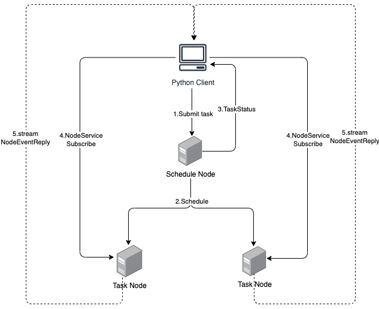

# 使用

***如何使用Python SDK***

## 简介



## 前提

- 安装了primihub python sdk
- 使用docker-compose启动节点应用，见[快速开始](https://docs.primihub.com/docs/quick-start)

## Python Client 初始化

1. 新建Python文件

2. 在文件开头引入primihub cli

   ```python
   import primihub as ph
   from primihub.client import primihub_cli as cli
   from primihub import context, dataset
   ```

3. client 初始化,输入正确的node信息，和证书地址（TODO）

   ```python
   cli.init(config={"node": "node_address:node_port", "cert": ""})
   ```

## 上传下载数据集

- 上传、下载

  ```python
  d = {'col1': [2, 3], 'col2': [3, 4], 'col3': [4, 5]}
  df = pd.DataFrame(d)
  
  # 上传
  data_ref = ph.dataset.put(df, "test_dataset_key")
  print(data_ref)
  
  # 下载
  df_data = ph.dataset.get(data_ref)
  
  
  ```

## 提交任务

1. 定义你的远程方法

   - host远程方法

   ```python
   # define a remote method
   @ph.context.function(role='host', protocol='xgboost', datasets=["label_dataset"], next_peer="*:12120")
   def func1(value):
       print("params: ", value)
       # do something
       return value + 1
   
   ```

   - guest 远程方法

   ```python
   # define a remote method
   @ph.context.function(role='guest', protocol='xgboost', datasets=["guest_dataset"], next_peer="localhost:12120")
   def func2(value):
       print("params: ", value)
       # do something
       return value + 1
   ```

2. 执行函数调用

   ```python
    value1 = 1
    value2 = 2
    cli.async_remote_execute((func1, value1), (func2, value2))
    cli.start()
   ```
