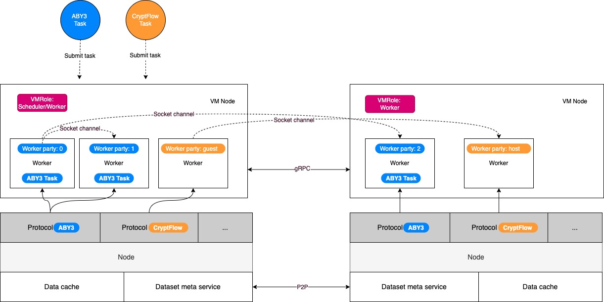

# Core Model

*** Get a first look at how Primihub works ***

- Node：An executable program that loads security protocols and receives computing requests. Nodes provide basic services for upper-layer protocol execution. Currently, the basic services provided include dataset metadata services and data caching services;
- Protocol：Refers to the multi-party secure computing MPC protocol
- VMNode：A virtual node is the executor of all tasks on the node
- VMNode role：Refers to the role played in a task execution, divided into two types a.Scheduler Node b.Worker Node
- Dataset：Refers to the data that the task needs to calculate
- Algorithm：Refers to the specific logic of task execution, which will be assigned to the specified node for execution according to the protocol
- Task：The MPC computing task being executed by a specific protocol. A computing task needs to specify the algorithm, data set, and protocol (the protocol can be automatically negotiated by the node according to the algorithm or manually specified)
- Worker：The loading and runner of the task (Task), a protocol (Protocol) assigned by the VMNode when the runtime is started;
- Worker party：Runtime roles specify roles related to security protocols based on incoming security protocols

## How the core model works

